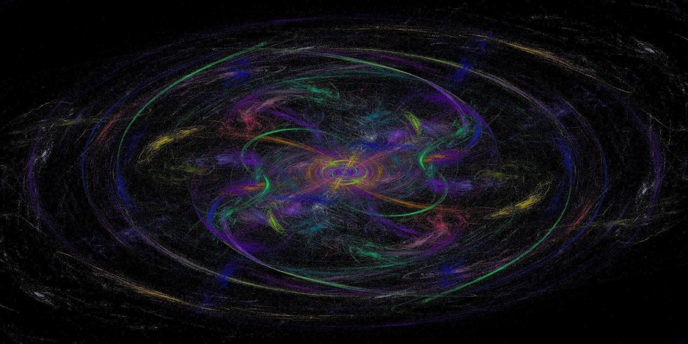
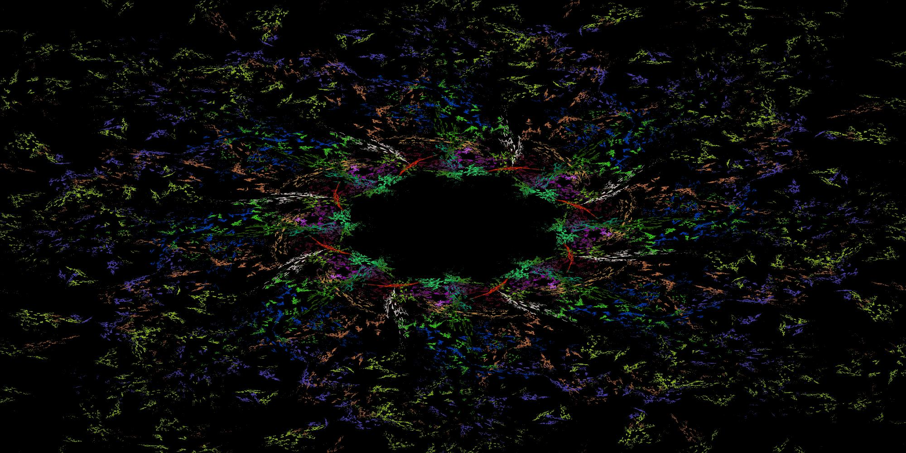

# Фрактальное пламя

## Описание проекта

Программа реализует алгоритм генерации изображения фрактального пламени с использованием системы итерируемых функций. В программе реализовано две версии: однопоточная и многопоточная.

**Примеры сгенерированных изображений**

    
    

    
    
    

    
    

    
    

    
    

    
    

***

## Функционал
- Реализация цветного алгоритма генерации фрактального пламени.
- Запуск в двух версиях: однопоточной и многопоточной.
- Сравнение времени работы обеих версий.
- Возможность настройки параметров: размера изображения, количества итераций.
- Возможность выбора из 11 трансформационных функций (выбрать можно одну или несколько).
- Возможность выбора параметра симметрии.
- Возможность выбора папки для сохранения изображений.
- Гамма-коррекция полученного алгоритмом изображения.

***
## Входные и выходные данные

### Ввод
Описание входных и выходных данных
Входные данные
- Размеры изображения (ширина и высота).
- Количество итераций функции для каждой точки (влияет на "заполненность" изображения).
- Показатель симметрии (степень двойки, где 0 - отсустствие симметрии).
- Директория для сохранения изображения (или выбор default папки).
- Выбор трансформаций из представленного списка (или случайный выбор).

### Вывод
- Два изображения, реализованные одно- и многопоточно, сохранённые по указанному при вводе пути.
- Скорость работы при однопоточной и многопоточной генерации. Для многопоточной дополнительно указано количество использованнных потоков.

***
## Тестирование

Тесты проверяют следующие аспекты:
- Корректность работы алгоритма на различных наборах параметров.
- Корректность трансформаций, преобразований, изменения цвета пикселя.
- Правильность работы гамма-коррекции получившегося изображения.
- Сравнение производительности одно- и многопоточной версий.

***
## Источники

* [Статья на хабре](https://habr.com/ru/articles/251537) с описанием фрактального пламени
* [Оригинальная статья об алгоритме](https://flam3.com/flame_draves.pdf) с каталогом вариаций
